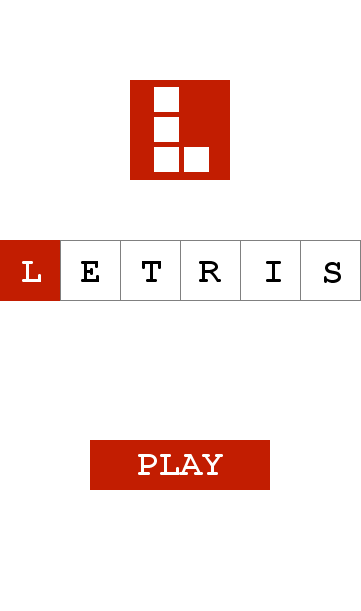
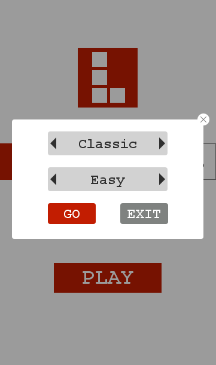
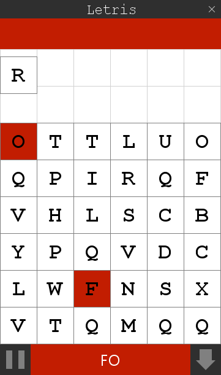
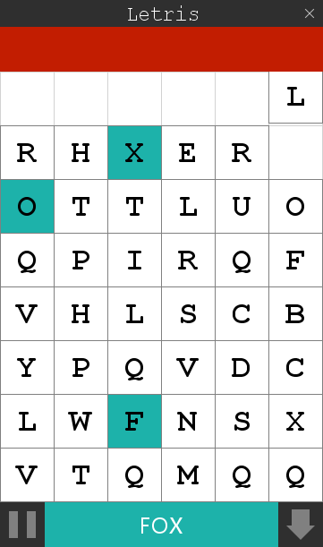

# Letris
Letris is a little game base on Tetris,when you click the letters make a correct word in right order,then you can eliminate those blocks.
All UIs randered by pure code with Swing,no pictures.

类似于欧罗斯方块，选中方块内的单词能够拼成一个3个字母以上的单词，就可以点击下方横杆消除选中的方块。

全部使用Java Swing完成，界面纯代码绘制，没有使用任何图片等资源。

